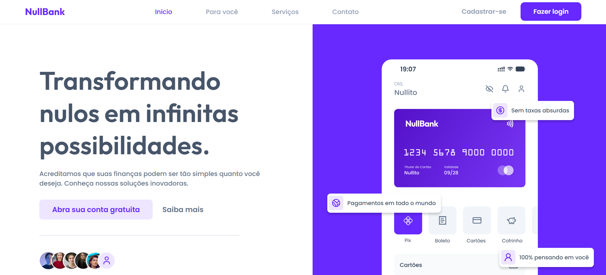

# NullBank



NullBank é um projeto simples de banco desenvolvido com HTML, CSS e JavaScript. Este projeto foi criado com o objetivo de fornecer uma interface básica para um banco fictício.Ele possui uma página principal que apresenta informações gerais sobre o banco, e uma página de contato onde os clientes podem enviar mensagens.

## Ajustes e melhorias

Embora o projeto já tenha sido concluído, há planos de realizar algumas melhorias e atualizações no futuro. As próximas atualizações serão voltadas para as seguintes tarefas:

- Melhorias na responsividade da página.
- Validação avançada do formulário de contato.
- Adicionar novas páginas e funcionalidades ao sistema, como uma área de login para clientes.

## 💻 Pré-requisitos

Antes de começar, verifique se você atendeu aos seguintes requisitos:

- Você instalou a versão mais recente do navegador web (Chrome, Firefox, etc.)
- Você tem uma máquina com Windows, Linux ou macOS. O projeto é compatível com todos esses sistemas operacionais.
- Você leu a documentação sobre HTML, CSS e JavaScript.

## 🚀 Instalando NullBank

Para instalar o NullBank, siga estas etapas:

### Linux e macOS:

1. Clone o repositório:
```
git clone https://github.com/evelynmartins220/Desafio-01.git
```

2. Navegue até a pasta do projeto: 
```
cd NullBank
```

3. Abra o arquivo index.html no seu navegador:
```
open index.html
```

### Windows:

1. Clone o repositório:
```
git clone https://github.com/evelynmartins220/Desafio-01.git
```

2. Navegue até a pasta do projeto: 
```
cd NullBank
```

3. Abra o arquivo index.html no seu navegador.

## ☕ Usando NullBank

Para usar NullBank, siga estas etapas:

1. Abra a página principal para conhecer o banco e explorar suas funcionalidades.

2. Acesse a página de contato para enviar mensagens ou dúvidas.

3. Preencha o formulário e clique em "Enviar". O JavaScript vai validar os seus dados.

## 📫 Contribuindo para NullBank

Para contribuir com NullBank, siga estas etapas:

1. Bifurque este repositório.
2. Crie um branch: `git checkout -b <nome_branch>`.
3. Faça suas alterações e confirme-as: `git commit -m '<mensagem_commit>'`
4. Envie para o branch original: `git push origin <nome_do_projeto> / <local>`
5. Crie a solicitação de pull.

Como alternativa, consulte a documentação do GitHub em [como criar uma solicitação pull](https://help.github.com/en/github/collaborating-with-issues-and-pull-requests/creating-a-pull-request).

## 🤝 Colaboradores

Agradecemos às seguintes pessoas que contribuíram para este projeto:

<table>
  <tr>
    <td align="center">
      <a href="#" title="defina o título do link">
        <br>
        <sub>
          <b>Evelyn Martins</b>
        </sub>
      </a>
    </td>
  </tr>
</table>
